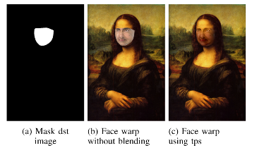

# FaceSwap

A python implementation of an end-to-end pipeline for swapping faces from images and videos using classical and deep learning approach.

### Run Instructions 
```
python Wrapper.py --src $Path_for_source_image --dst $Path_for_destination_image --result Path_for storing_output_images/video --video $Path_for_input_video --method $METHOD_TYPE --mode $MODDE_TYPE
```
$MEHTOD_TYPE : 1 -> deltriangle; 2-> tps; 3 -> prnet

$MODE_TYPE : 1 -> Swap faces in two images ; 2 -> Swap face in video with an image; 3 -> Swap faces in a video

## Classical Approach

### Pipeline


### Facial Landmarks detection
 Inbuilt library dlib is used which is based on SVM face detector.
 
 
 ### Face Warping using Triangulation and Thin Plate Spline
  
  
## Deep Learning Approach
  ## PRNet
  
    
  
  
This was implemented as part of [CMSC733](https://cmsc733.github.io/2022/proj/p2/) and for detailed report refer [here](Report.pdf)
  
 
 
